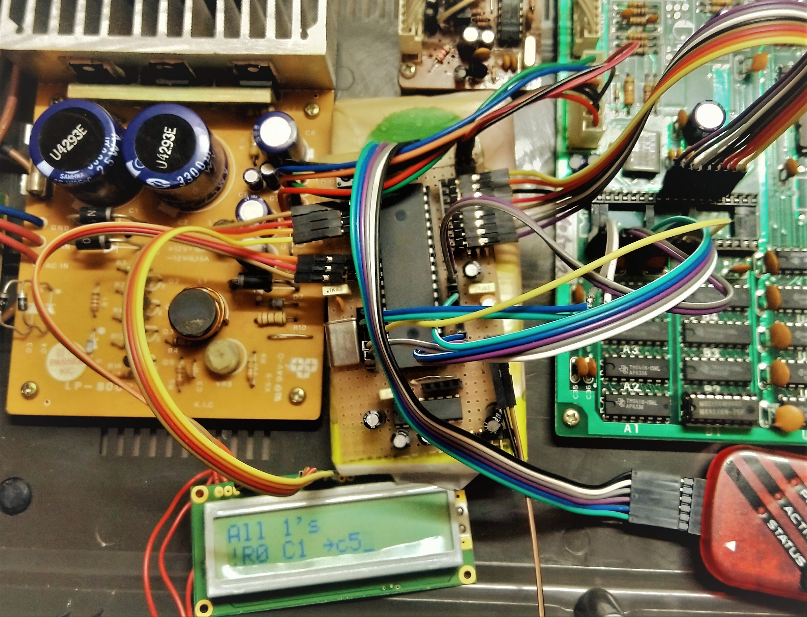

# Tester for DRAM modules

Do you need an hardware DRAM tester to find a faulty chip in your vintage 8-bit computer?

Do you have a space Microchip MCU +5V compatible with enough pins to drive the RAM lines and a 2-lines display for a completely stand-alone tool?

Then try this project on your preferred 16F MCU.

<i>The tester running on a PIC16F877 mounted on a prototype matrix board to test the video DRAM of a MSX computer.</i>

# How it works

The MCU will store data in different patterns filling the DRAM modules. Then it waits at least one refresh cycle before reading back the data and check for errors.

The patterns implemented so far are:
- Write all zeros
- Write all ones
- Write 0x55 and 0xAA patterns
- Write a pattern based on auto-increment

Any error will be briefly reported in the embedded display. Any CM1602-based display will work (4-bit protocol). 

In addition, it features other functions to look closely at noise on power rails on the DRAM modules, in case the power supply is failing (quite often in vintage electronic), or to test a specific unstable bit:
- Continous refresh
- Continous read and write a fixed position

It is possible to cycle different run mode resetting the device: at each reset (/MCLR drive down) the next mode will be executed.

# How to build

Build the project using the [MPLAB-X IDE](https://www.microchip.com/mplab/mplab-x-ide) and a [XC8 Compiler](https://www.microchip.com/mplab/compilers).

NOTE: If you need exact timing, prefer a PRO version of the compiler. Otherwise longer timing can be obtained. This is not critical, but it could make the test take longer.
